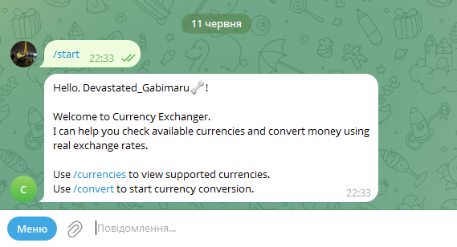
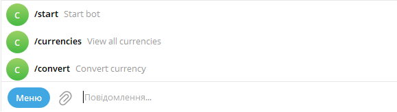
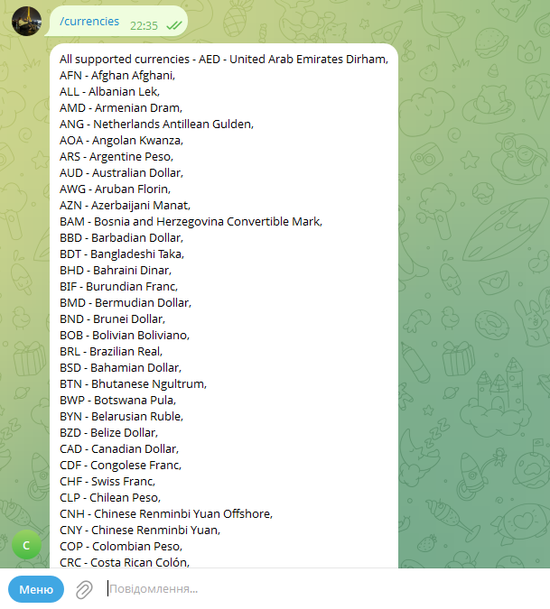
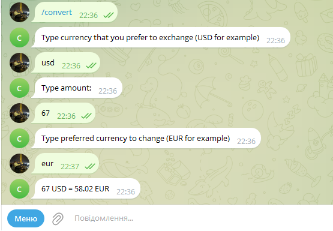

# Currency Exchange - Telegram Bot


A simple Telegram bot for checking supported currencies and converting money between currencies using the **Frankfurter API**. The bot is built with **aiogram** and uses an FSM flow to guide users through the conversion process step by step.

## Features

- Start command with basic bot interaction
- View all supported currencies from Frankfurter API
- Convert currency using real exchange rates
- Step-by-step conversion flow with aiogram FSM
- Currency input normalization, for example `usd` becomes `USD`
- Cancel keyboard for stopping the conversion process
- Clean project structure with separate handlers, FSM form, settings, and API logic

## Tech Stack

- **Backend**: Python 3
- **Telegram Framework**: aiogram
- **HTTP Client**: aiohttp
- **Environment Variables**: python-dotenv
- **Currency API**: Frankfurter API
- **Architecture**: Router-based handlers + FSM states

## Screenshots

**1. Start message**  


**2. Bot menu commands**  


**3. Supported currencies list**  


**4. Currency conversion flow**  


## Bot Commands

```text
/start - Start bot
/currencies - View all supported currencies
/convert - Convert currency
```

## Project Structure

```text
currency-exchange/
+-- exchange/
|   +-- api.py          # Frankfurter API requests and conversion logic
|   +-- tools.py        # Helper functions and keyboard builder
+-- form.py             # FSM states for currency conversion
+-- fsm.py              # Conversion dialog handlers
+-- handler.py          # Basic command handlers
+-- main.py             # Bot entry point
+-- settings.py         # Environment variables and router setup
+-- requirements.txt    # Project dependencies
+-- .env                # Local environment variables
```

## Conversion Flow

The `/convert` command starts a step-by-step FSM dialog:

1. User enters the base currency, for example `USD`.
2. Bot checks whether this currency is supported.
3. User enters the amount.
4. User enters the quote currency, for example `EUR`.
5. Bot requests the current rate from Frankfurter API.
6. Bot sends the converted result back to the user.

Example:

```text
100 USD = 92.35 EUR
```

## How to Run Locally

### 1. Clone the repository

```bash
git clone https://github.com/santar4/currency-exchange.git
cd currency-exchange
```

### 2. Create a virtual environment

```bash
python -m venv venv
```

### 3. Activate the virtual environment

Windows:

```bash
venv\Scripts\activate
```

Mac/Linux:

```bash
source venv/bin/activate
```

### 4. Install dependencies

```bash
pip install -r requirements.txt
```

### 5. Create a `.env` file

Create a `.env` file in the project root and add your Telegram bot token:

```env
BOT_TOKEN=your_telegram_bot_token
```

You can get a token from [@BotFather](https://t.me/BotFather).

### 6. Run the bot

```bash
python main.py
```

## API

This project uses the Frankfurter API:

```text
https://api.frankfurter.dev/v2
```

Used endpoints:

```text
GET /currencies
GET /rate/{base}/{quote}
```

Frankfurter API does not require an API key.

## Security Note

Do not commit your real `.env` file with `BOT_TOKEN` to GitHub. Keep tokens private and use an example file such as `.env.example` for public repositories.
